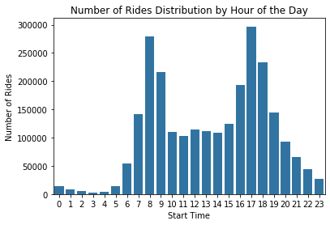

# Bike Trips Dataset Exploration
## by Rubén Triviño

## Dataset
We will use a dataset from BayWheels of bike trips. Will explore possible relationships between trips duration, day of the week, hour of the day and number of rides.

We will download dataset of single month csv files and merge them into a single year dataset so we may perform further analysis.

The data structures includes anonimous bike rides containing the next information per ride:
* Trip duration (seconds).
* Start datetime.
* Finish datetime.
* Station ID where the ride starts from.
* Station name where the ride starts from.
* Latitude of the station where the ride starts from.
* Longitude of the station where the ride starts from.
* Station ID where the ride ends.
* Station name where the ride ends.
* Latitude of the station where the ride ends.
* Longitude of the station where the ride ends.
* Bike ID
* User type (Subscriber or Customer)

All of the data is very interesting: start date may help us understand if certain day of the week has more higher usage ratio of the bikes or even it may shows a relation between trips duration. In addition, the identification of the main bike stations may show a problem related to the availability of bikes due to the fact that many people start the raid in a station but they drop the bike in a very different one so the company need to replenish the station every certain period of time. Also, ID of bike may help us the how often the same bake is used during his lifetime so we may identify the potencial value that a single bike may generate over its costs. Furthermore, the type of user and how it enganges to the bike usage overtime may help us understand what type of user we are interested in and what type we should look forward to get more of them, what time it requires to convert a casual consumer into a subscriber.

From all these ideas the key feature is <b>Time</b>.

For the porpuse of this study we will be keen on the start datetime of the ride and its duration. Which day of the week has the most number of rides? Is there certain hour of the day that has a spike on rentals? May it be related to the duration of the ride? Is theree any difference in bike usage between user types?
Then, in order to answer these questions we will use these main features of the dataset:
* Start Time (hour of the day, day of the week)
* Duration
* User Type

### Minor Data Wrangling
We have changed data type of Start and End Time to datetime instead of default type String. Thus, we will operate conviniently with dates. We also extracted the day of the week from date to filter data easily.

## Summary of Findings

We have explored the relationship between user type, trips duration, day of the week and usage distribution.

## Key Insights for Presentation

> Select one or two main threads from your exploration to polish up for your presentation. Note any changes in design from your exploration step here.